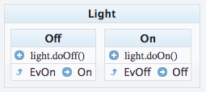
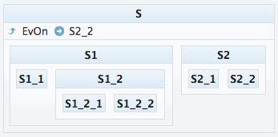

# UML State Machine

[](https://greenkeeper.io/)

An implemenation of the UML state machine pattern in Javascript. 

* Hierarchical
* onEntry onExit function
* Observable

## Install

```bash
npm install uml-state-machine --save
```

## Usage

Here is the hello word of finite state machine: a light switch: 

 * 2 events: `evOn` and `evOff`.
 * 2 states: `Off` and `On`.
 * 2 actions: `light.doOff()` and  `light.doOn()`.

State machine diagram describing the light switch:





```javascript

const stateMachineDefinition = {
  name: "LightSwitch",
  events: ["evOn", "evOff"],
  state: {
    states: {
      "Off": {
        onEntry: light => light.doOff(),
        transitions: [{
          event: "evOn",
          nextState: "On",
          actions:[
            light => light.log("starting on")
          ]
        }]
      },
      "On": {
        onEntry: light => light.doOn(),
        transitions: [{
          event: "evOff",
          nextState: "Off",
          actions:[
            light => light.log("starting off")
          ]
        }]
      }
    }
  }
}

const light = Light();

const machine = Machine({
  definition: stateMachineDefinition,
  actioner: light
});

machine.enterInitialState();
machine.evOff();
machine.evOn();

```

## Hierarchical example

Hierarchical state machine allows to model state as a tree, the goal is to gather states that share common transitions. 
When transitioning from one state to another, a chain of `onExit` and `onEntry` functions is called. 





```javascript
const smDef = {
  name: "Hierarchical",
  events: ["evOn", "evOff"],
  state: {
    transitions: [{event:"evOn", nextState:"S2_3"}],
    states: {
      "S1": {
        states:{
          "S1_1":{},
          "S1_2":{
            states:{
              "S1_2_1":{},
              "S1_2_2":{}
            }
          }
        }
      },
      "S2":{
        states:{
          "S2_1":{},
          "S2_2":{},
          "S2_3":{}
        }
      }
    }
  }
}

const machine = Machine({
  definition: smDef
});

machine.enterInitialState();
/*
onEntry  S
onEntry  S1
onEntry  S1_1
*/
machine.evOn()
/*

onTransitionBegin  S1_1 S2_3
onExit  S1_1
onExit  S1
onEntry  S2
onEntry  S2_3
onTransitionEnd  S1_1 S2_3
*/

```

## Observable

To find out what's going on inside the state mahine, customs `observers` can be attached.

Below is an example of a simple observer that logs when a state enters or exits, and when a transition begins and ends.

```javascript

const machine = Machine({
  definition: smDef,
  observers: {
    onEntry(context, stateName) {
      console.log("onEntry ", stateName)
    },
    onExit(context, stateName) {
      console.log("onExit ", stateName)
    },
    onTransitionBegin(context, statePrevious, stateNext) {
      console.log("onTransitionBegin ", statePrevious, stateNext)
    },
    onTransitionEnd(context, statePrevious, stateNext) {
      console.log("onTransitionEnd ", statePrevious, stateNext)
    }
  }
});

```
